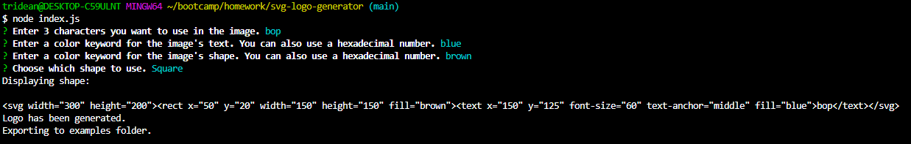

# SVG Logo Maker
  
  ## Description
  Creates an SVG logo using user inputs based on any color and 3 options for shapes.
  ## Deployed Application URL
  https://github.com/tridean/svg-logo-generator
  ## Screenshot
  
  ## Table of Contents
  * [Technologies Used](#Technologies-Used)
  * [Contributors](#contributors)
  * [Testing](#testing)
  * [Questions](#questions)
  ## Technologies Used:
  JS, Node.js, Jest, Inquirer
  ## Contributors
  n/a
  ## Testing
  npm test
  ## Questions
  Send all questions to tridean97@gmail.com or check out my [GitHub](https://github.com/tridean).
  ## License
This project is covered under MIT.
